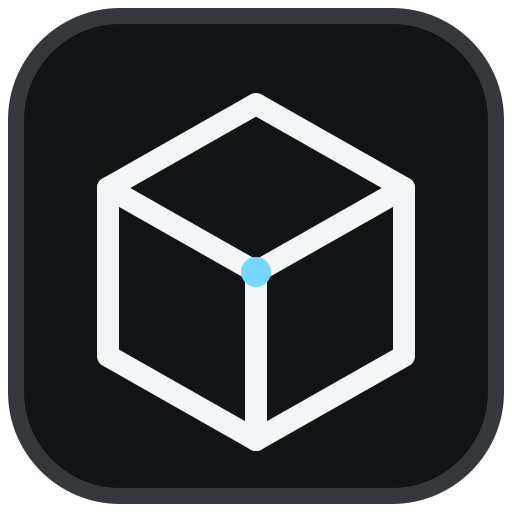
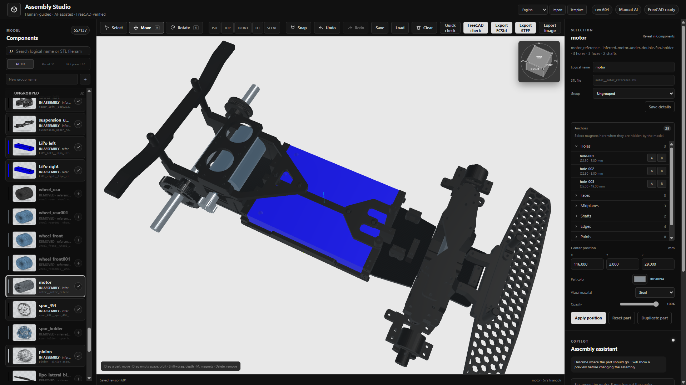

# Assembly Studio

<p align="center">
  
</p>

A local web studio for CAD assemblies, with a lightweight 3D viewport,
positioning tools, persistent editing, and optional FreeCAD-based geometric
validation. The included demonstration project is an RC car.



> [!WARNING]
> **This is an experimental, early-stage project.** Features, saved state,
> geometric results, and exports may contain errors or behave unpredictably.
> Always keep backups of the original files and independently verify every
> result with appropriate CAD software before manufacturing parts or using them
> in real-world or safety-critical applications.

## Quick start

Requirements: Node.js 18 or newer. The STL assets used by the demonstration
assembly are included in the repository.

```bash
npm install
npm start
```

Open <http://127.0.0.1:4173>.

`npm install` copies the required Three.js modules into the frontend, so the
application does not depend on a CDN at runtime. The start command limits the
Node.js heap to 384 MiB to prevent an abnormal memory spike from exhausting a
small host. State and undo/redo history are stored as compact JSON to reduce
memory pressure and disk I/O without dropping operations.

Assembly Studio works without AI and without FreeCAD for manual positioning,
snapping, grouping, undo/redo, materials, scene configuration, and PNG/SVG
image exports.

## Features

- Interactive Three.js assembly viewport with move and rotate gizmos.
- Persistent groups, component names, colors, materials, opacity, and scene
  settings.
- Up to 500 persistent undo/redo operations by default.
- Reusable component catalog with independent instances.
- Parametric socket-cap, button-head, and countersunk fasteners with modeled hex drives and batch insertion into multiple holes.
- A 49-size bearing catalog plus custom dimensions, with distinct Open, ZZ,
  and 2RS colors.
- Automatic bearing size matching from a selected shaft, housing, or coaxial
  shaft-and-housing pair.
- Quick AABB interference checks in the browser workflow.
- Optional exact collision checks through isolated FreeCAD workers.
- FCStd, STEP, PNG, SVG, and portable project exports.
- English, Italian, French, and Spanish interface translations.
- Importable translation packs with English fallback.

## CAD magnets and constraints

Press **Snap** or `M`, then select two magnets. The second click applies the
constraint immediately. If one component is locked, Assembly Studio
automatically moves the other one.

Supported pairing modes include:

- hole to hole;
- face to face;
- shaft to hole;
- axis to axis;
- edge to edge;
- point to point;
- pin to slot;
- cylinder tangent to plane;
- center to plane;
- midplane alignment.

The magnet filter prevents thousands of references from being displayed at
once. **All magnets** remains available when full visibility is needed.

The **2-hole pattern** mode collects two matching hole pairs and computes one
rigid transformation. A shaft can also be aligned through two guide holes or
cylindrical seats. After snapping, the part can be rotated by a preset or custom
angle and offset along the mating axis.

Persistent motion constraints include rigid, hinge, slider, ball joint, gear
ratio, limits, and lock.

## Image export and lighting

The image exporter provides repeatable orthographic-style viewpoints and PNG
or SVG output up to 4K. **Fit model to width** uses the selected view direction
and fills the output width automatically.

Scene lighting and material reflections are independent in **Scene
appearance**, with separate intensity controls and live preview. The
**Technical** preset and **Dark-part lift** keep black components readable
without changing their stored colors. Cancel restores the previous appearance;
Reset previews the defaults until Apply is pressed. Disabling both lighting and
reflections uses flat unlit colors and avoids artificial highlights in technical
images and PNG exports.

## AI integration

AI integration is a work in progress. Assembly Studio is fully usable in manual
mode, and no API key or credential is included in this repository.

Assembly-instruction generation is also planned work; the **AI off** badge only
reports assistant availability and does not currently mean "AI manual." A
reliable instruction generator will derive ordered steps from confirmed mates,
fasteners, and captured assembly stages rather than guessing from the final
model alone.

## Typical workflow

1. Select a component in the viewport or component list.
2. Press `W` to move it or `E` to rotate it.
3. Alternatively, enter its center coordinates in the inspector.
4. Apply CAD magnet constraints where appropriate.
5. Run **Quick check** for a broad-phase AABB estimate.
6. Run **FreeCAD check** for isolated exact boolean checks when FreeCAD is
   available.
7. Export the current revision as FCStd, STEP, PNG, or SVG.

The demonstration chassis is locked because it defines the reference frame.
Every edit is persisted atomically in `webapp/data/assembly.json`.
`Ctrl/Cmd+Z` performs undo; `Ctrl/Cmd+Shift+Z` and `Ctrl/Cmd+Y` perform redo.
The history limit can be configured with `RC_CAR_HISTORY_DEPTH`.

## FreeCAD integration

FreeCAD is optional. The viewer, manual editing, snapping, groups, undo/redo,
materials, and image exports work without it. FreeCAD is currently required
only for exact geometric validation and FCStd/STEP generation.

The frontend can be reused with other assemblies by providing meshes and a
manifest JSON. Replacing FreeCAD entirely for exact CAD operations would
require another geometry kernel, such as a standalone OpenCascade service.

The server searches for `freecadcmd` in standard system locations and in the
extracted AppImage used by this workspace. A custom command can be provided:

```bash
FREECADCMD=/path/to/freecadcmd npm start
```

CAD work never runs inside the Node.js server process. Each export uses a
separate FreeCAD worker. Exact collision booleans are further isolated with a
memory allowance and a timeout per candidate pair, so an OpenCascade failure
does not terminate the web application.

Generated downloads are written to `build/web/`, which is intentionally
excluded from version control.

## Regenerating geometry and initial state

When the base assembly changes:

```bash
$FREECADCMD tools/export_stl_components.py --pass \
  build/assembly/rc_car_full_working_v9.FCStd \
  webapp/public/assets/assembly

$FREECADCMD tools/extract_snap_interfaces.py --pass \
  build/assembly/rc_car_full_working_v9.FCStd \
  build/assembly/snap_interfaces_v9.json

python3 tools/prepare_web_assembly.py \
  build/assembly/rc_car_full_working_v9.json \
  webapp/public/assets/assembly/stl_manifest.json \
  build/assembly/collisions_v9.json \
  build/assembly/snap_interfaces_v9.json \
  webapp/data/assembly.json
```

Regeneration replaces the working state. Back it up first if it contains edits
that must be preserved.

## Translations

The interface includes English, Italian, French, and Spanish. Translators do
not need to edit application code: **Template** downloads a translation JSON,
and **Import** validates and loads it in the browser. Missing or empty keys fall
back to English. The format is documented in
`webapp/public/locales/README.md` and `translation.schema.json`.

## Tests

```bash
npm test
python3 -m py_compile tools/*.py
```

## Main API endpoints

- `GET /api/assembly`
- `POST /api/operations/preview`
- `POST /api/operations/apply`
- `POST /api/operations/undo`
- `POST /api/operations/redo`
- `POST /api/mates/preview`
- `POST /api/mates/apply`
- `POST /api/snaps/preview`
- `POST /api/snaps/apply`
- `POST /api/ai/propose`
- `POST /api/validate/approximate`
- `POST /api/validate/exact`
- `POST /api/export`
- `POST /api/export/step`
